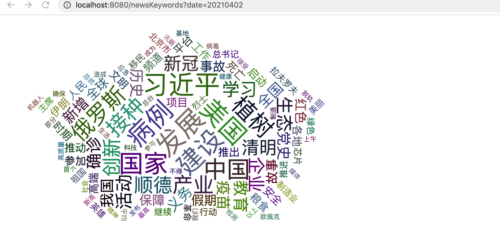
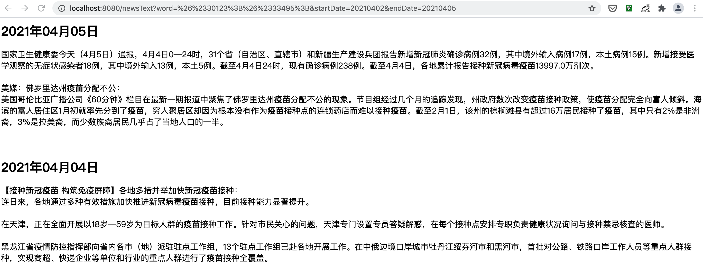

## 新闻联播文字内容分析

### Install:
1. 安装java及maven环境
2. 需要配合 [xwlbSpider](https://github.com/wuruiliang/xwlbSpider) 使用
3. create database(如果已经创建可不创建):
      ```sql
      CREATE DATABASE xwlb
      ```
4. 使用脚本`./start.sh -f -g`初始化数据库
> 如果使用`xwlbSpider`的时候已经先创建了表请使用`./start.sh -b -g`
5. 使用`xwlbSpider`爬取需要分析的数据


### Run:
`./start.sh -r xwlb-api` 启动web程序
> 调用`/newsKeywords`接口可展示选择时间内新闻关键字文字云图，点击图中的文字跳转展示具体的新闻内容。
>
> 请求格式：`http://localhost:8080/newsKeywords?startDate=20210402&endDate=20210405` 或 `http://localhost:8080/newsKeywords?date=20210402`

`./start.sh -r xwlb-scheduler` 启动scheduler程序
> 可异步进行建立分词索引的工作

### Demo Pictures:
- 关键字云图：

  
  
- 相关新闻片段：

